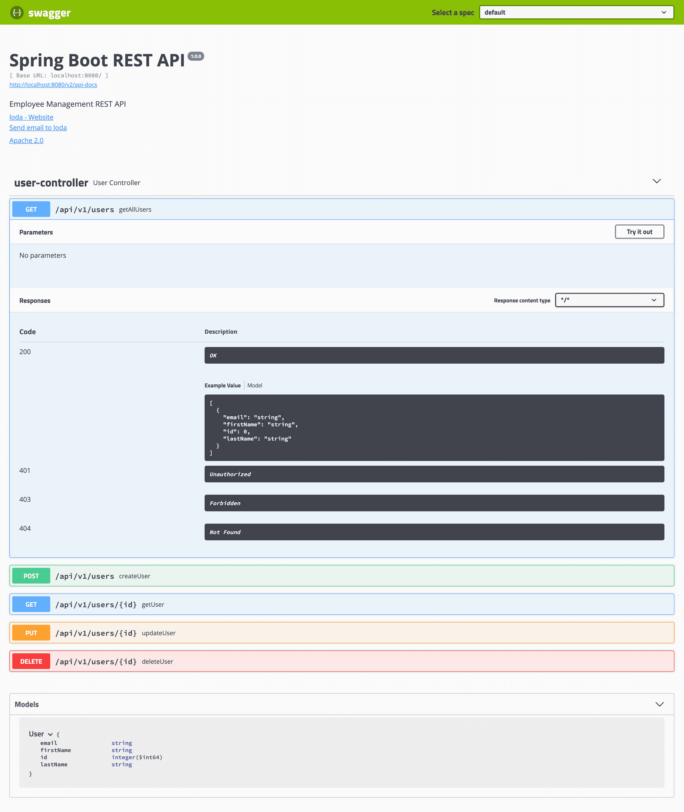

### Giới thiệu

RESTful API Document Tạo với Spring Boot + Swagger
Giới thiệu
cài đặt
Tổng quan Swagger
Prepare
Config Swagger
Góc custom
# Giới thiệu
Spring Boot hỗ trợ chúng ta tạo ra RESTful API một cách nhanh chóng và tiện lợi, giúp sản phẩm được vận hành nhanh nhất có thể.

Tuy nhiên, Việc deploy nhanh chóng một services không đồng nghĩa với việc nó có thể sử dụng được. Thông thường, tất cả các API sau khi được đưa lên sẽ phải đi kèm với document mô tả, để bất kì ai sử dụng đến thì có thể tra cứu.

Thật không may là việc làm document chưa bao giờ là dễ dàng cả :(( từ lí do này, Swagger ra đời để giúp chúng ta mô tả tài liệu dự án một cách nhanh chóng bằng annotation.

Trong bài có đề cập các kiến thức:

1. Spring Boot
2. jpa
3. lombok

# cài đặt
Trong bài này, tôi sẽ hướng dẫn các bạn sử dụng Swagger2 và tuân theo các quy tắc cảu Swagger Specification 2.0 nhé.

Tại thời điểm viết bài này, hiện phiên bản mới nhất là 3, tuy nhiên, nó sẽ là OpenAPI 3.0.

pom.xml

<pre class="language-xml">&lt;?xml version="1.0" encoding="UTF-8"?&gt;
&lt;project xmlns="http://maven.apache.org/POM/4.0.0" xmlns:xsi="http://www.w3.org/2001/XMLSchema-instance"
	xsi:schemaLocation="http://maven.apache.org/POM/4.0.0 https://maven.apache.org/xsd/maven-4.0.0.xsd"&gt;
	&lt;modelVersion&gt;4.0.0&lt;/modelVersion&gt;

	&lt;parent&gt;
		&lt;groupId&gt;org.springframework.boot&lt;/groupId&gt;
		&lt;artifactId&gt;spring-boot-starter-parent&lt;/artifactId&gt;
		&lt;version&gt;2.0.5.RELEASE&lt;/version&gt;
		&lt;relativePath/&gt; &lt;!-- lookup parent from repository --&gt;
	&lt;/parent&gt;

	&lt;groupId&gt;me.loda.spring&lt;/groupId&gt;
	&lt;artifactId&gt;example-independent-maven-spring-project&lt;/artifactId&gt;
	&lt;version&gt;0.0.1-SNAPSHOT&lt;/version&gt;
	&lt;name&gt;example-independent-maven-spring-project&lt;/name&gt;
	&lt;description&gt;Demo project for Spring Boot&lt;/description&gt;

	&lt;properties&gt;
		&lt;java.version&gt;1.8&lt;/java.version&gt;
	&lt;/properties&gt;

	&lt;dependencies&gt;
		&lt;dependency&gt;
			&lt;groupId&gt;org.springframework.boot&lt;/groupId&gt;
			&lt;artifactId&gt;spring-boot-starter-web&lt;/artifactId&gt;
		&lt;/dependency&gt;

		&lt;dependency&gt;
			&lt;groupId&gt;org.springframework.boot&lt;/groupId&gt;
			&lt;artifactId&gt;spring-boot-devtools&lt;/artifactId&gt;
			&lt;scope&gt;runtime&lt;/scope&gt;
			&lt;optional&gt;true&lt;/optional&gt;
		&lt;/dependency&gt;
		&lt;dependency&gt;
			&lt;groupId&gt;org.projectlombok&lt;/groupId&gt;
			&lt;artifactId&gt;lombok&lt;/artifactId&gt;
			&lt;optional&gt;true&lt;/optional&gt;
		&lt;/dependency&gt;
		&lt;dependency&gt;
			&lt;groupId&gt;org.springframework.boot&lt;/groupId&gt;
			&lt;artifactId&gt;spring-boot-starter-test&lt;/artifactId&gt;
			&lt;scope&gt;test&lt;/scope&gt;
		&lt;/dependency&gt;
		
		&lt;dependency&gt;
			&lt;groupId&gt;io.springfox&lt;/groupId&gt;
			&lt;artifactId&gt;springfox-swagger2&lt;/artifactId&gt;
			&lt;version&gt;2.9.2&lt;/version&gt;
		&lt;/dependency&gt;

		&lt;dependency&gt;
			&lt;groupId&gt;io.springfox&lt;/groupId&gt;
			&lt;artifactId&gt;springfox-swagger-ui&lt;/artifactId&gt;
			&lt;version&gt;2.9.2&lt;/version&gt;
		&lt;/dependency&gt;

		&lt;!--spring jpa--&gt;
		&lt;dependency&gt;
			&lt;groupId&gt;org.springframework.boot&lt;/groupId&gt;
			&lt;artifactId&gt;spring-boot-starter-data-jpa&lt;/artifactId&gt;
		&lt;/dependency&gt;
		&lt;!--in memory database--&gt;
		&lt;dependency&gt;
			&lt;groupId&gt;com.h2database&lt;/groupId&gt;
			&lt;artifactId&gt;h2&lt;/artifactId&gt;
			&lt;scope&gt;runtime&lt;/scope&gt;
		&lt;/dependency&gt;
	&lt;/dependencies&gt;

	&lt;build&gt;
		&lt;plugins&gt;
			&lt;plugin&gt;
				&lt;groupId&gt;org.springframework.boot&lt;/groupId&gt;
				&lt;artifactId&gt;spring-boot-maven-plugin&lt;/artifactId&gt;
			&lt;/plugin&gt;
		&lt;/plugins&gt;
	&lt;/build&gt;

&lt;/project&gt;</pre>

springfox là một thư viện java implementation của Swagger Specification.

springfox-swagger2 chứa core của swagger, giúp chúng ta khai báo document cho api.

springfox-swagger-ui giúp chúng ta biểu diễn tài liệu dưới dạng web view, dễ nhìn và test.

# Tổng quan Swagger
Để sử dụng cơ bản thì Swagger cung cấp một số các Annotations hữu ích sau:
<table>
<thead>
<tr>
<th>Syntax</th>
<th>Description</th>
</tr>
</thead>
<tbody>
<tr>
<td>@Api</td>
<td>Đánh dấu 1 class là nơi chứa các API</td>
</tr>
<tr>
<td>@ApiModel</td>
<td>Đánh dấu 1 class là Swagger Model</td>
</tr>
<tr>
<td>@ApiModelProperty</td>
<td>Bổ sung các thông tin cho</td>
</tr>
<tr>
<td>@ApiOperation</td>
<td>Mô tả cho một API và response của nó</td>
</tr>
<tr>
<td>@ApiParam</td>
<td>Mô tả các parameter</td>
</tr>
<tr>
<td>@ApiResponse</td>
<td>Mô tả status code của response</td>
</tr>
<tr>
<td>@ApiResponses</td>
<td>Mô tả danh sách các status code của response</td>
</tr>
</tbody>
</table>
==========================
Chúng ta đi vào thực hành thử nhé.

Đại loại sau khi làm xong, chúng ta sẽ có 1 web view document như thế này:

# Prepare
Tạo ra class Model

User.java

<pre class="language-java">@Data
@Entity
@Table
@NoArgsConstructor
@AllArgsConstructor
public class User {
    @Id
    @GeneratedValue(strategy = GenerationType.IDENTITY)
    private Long id;

    private String firstName;
    private String lastName;
    private String email;
}</pre>

UserRepository.java

Khi đã có được Model và Repository, chúng ta sẽ tạo Controller để thao tác liên quan tới User nhé.<pre class="language-java">@RestController
@RequestMapping("/api/v1")
@RequiredArgsConstructor
public class UserController {
    private final UserRepository userRepository;

    @GetMapping("/users")
    public List&lt;User&gt; getAllUsers() {
        return userRepository.findAll();
    }

    @GetMapping("/users/{id}")
    public User getUser(@PathVariable("id") Long id) {
        return userRepository.findById(id).orElse(new User());
    }

    @PostMapping("/users")
    public User createUser(@Valid @RequestBody User user) {
        return userRepository.save(user);
    }

    @PutMapping("/users/{id}")
    public User updateUser(@PathVariable("id") Long id, @Valid @RequestBody User user) {
        user.setId(id);
        return userRepository.save(user);
    }

    @DeleteMapping("/users/{id}")
    public void deleteUser(@PathVariable("id") Long id) {
        userRepository.deleteById(id);
    }
}</pre>

Bây giờ vào phần chính, config Swagger cho dự án của chúng ta.

# Config Swagger
Thật may mắn, trước khi đi vào các custom phức tạp thì Swagger hỗ trợ chúng ta tự động sinh ra tài liệu một cách mặc định mà chưa cần phải khai báo bất kì annotation nào đã giới thiệu ở trên.

Chỉ cần tạo ra đối tượng Docket của Swagger và nó sẽ quét hết các địa chỉ API mà bạn chỉ định, rồi tự động sinh ra tài liệu cơ bản cho chúng ta.

<pre class="language-java">@Configuration
@EnableSwagger2
public class Swagger2Config {
    @Bean
    public Docket api() {
        return new Docket(DocumentationType.SWAGGER_2).select()
                                                      .apis(RequestHandlerSelectors.basePackage("me.loda.spring.swagger.controller"))
                                                      .paths(PathSelectors.regex("/.*"))
                                                      .build()
                                                      .apiInfo(apiEndPointsInfo());
    }

    private ApiInfo apiEndPointsInfo() {
        return new ApiInfoBuilder().title("Spring Boot REST API")
                                   .description("Employee Management REST API")
                                   .contact(new Contact("loda", "https://loda.me/", "loda.namnh@gmail.com"))
                                   .license("Apache 2.0")
                                   .licenseUrl("http://www.apache.org/licenses/LICENSE-2.0.html")
                                   .version("1.0.0")
                                   .build();
    }
}</pre>

Các thứ cần lưu ý bao gồm:

1. Để Swagger hoạt động, bạn nhớ kích hoạt nó bằng @EnableSwagger2.
2. Bạn có thể chọn nơi chứa các API bằng RequestHandlerSelectors. Nếu muốn quét hết cả project, có thể xài RequestHandlerSelectors.any()
3. Bạn có thể chỉ định bộ lọc cho các api bằng PathSelectors. Nếu muốn quét tất cả, chọn PathSelectors.any().

<pre class="language-java">@Configuration
@EnableSwagger2
public class Swagger2Config {
    @Bean
    public Docket api() {
        return new Docket(DocumentationType.SWAGGER_2).select()
                                                      .apis(RequestHandlerSelectors.basePackage("me.loda.spring.swagger.controller"))
                                                      .paths(PathSelectors.regex("/.*"))
                                                      .build()
                                                      .apiInfo(apiEndPointsInfo());
    }

    private ApiInfo apiEndPointsInfo() {
        return new ApiInfoBuilder().title("Spring Boot REST API")
                                   .description("Employee Management REST API")
                                   .contact(new Contact("loda", "https://loda.me/", "loda.namnh@gmail.com"))
                                   .license("Apache 2.0")
                                   .licenseUrl("http://www.apache.org/licenses/LICENSE-2.0.html")
                                   .version("1.0.0")
                                   .build();
    }
}</pre>

Bây giờ, chạy thử và vào địa chỉ http://localhost:8080/swagger-ui.html để xem thành quả nhé.

# Góc custom
Bạn có thể chỉ định rõ hơn các mô tả của tài liệu bằng cách sử dụng các Annotation mà Swagger cung cấp.

## User.java
<pre class="language-java">@Configuration
@EnableSwagger2
public class Swagger2Config {
    @Bean
    public Docket api() {
        return new Docket(DocumentationType.SWAGGER_2).select()
                                                      .apis(RequestHandlerSelectors.basePackage("me.loda.spring.swagger.controller"))
                                                      .paths(PathSelectors.regex("/.*"))
                                                      .build()
                                                      .apiInfo(apiEndPointsInfo());
    }

    private ApiInfo apiEndPointsInfo() {
        return new ApiInfoBuilder().title("Spring Boot REST API")
                                   .description("Employee Management REST API")
                                   .contact(new Contact("loda", "https://loda.me/", "loda.namnh@gmail.com"))
                                   .license("Apache 2.0")
                                   .licenseUrl("http://www.apache.org/licenses/LICENSE-2.0.html")
                                   .version("1.0.0")
                                   .build();
    }
}</pre>

## UserController.java
<pre class="language-java">@RestController
@RequestMapping("/api/v1")
@RequiredArgsConstructor
@Api(value = "User APIs")
public class UserController {
    private final UserRepository userRepository;

    @ApiOperation(value = "Xem danh sách User", response = List.class)
    @ApiResponses(value = {
            @ApiResponse(code = 200, message = "Thành công"),
            @ApiResponse(code = 401, message = "Chưa xác thực"),
            @ApiResponse(code = 403, message = "Truy cập bị cấm"),
            @ApiResponse(code = 404, message = "Không tìm thấy")
    })
    @GetMapping("/users")
    public List&lt;User&gt; getAllUsers() {
        return userRepository.findAll();
    }

    @GetMapping("/users/{id}")
    public User getUser(@PathVariable("id") Long id) {
        return userRepository.findById(id).orElse(new User());
    }

    @PostMapping("/users")
    public User createUser(
            @ApiParam(value = "Đối tượng User cần tạo mới", required = true) @Valid @RequestBody User user
    ) {
        return userRepository.save(user);
    }

    @PutMapping("/users/{id}")
    public User updateUser(@PathVariable("id") Long id, @Valid @RequestBody User user) {
        user.setId(id);
        return userRepository.save(user);
    }

    @DeleteMapping("/users/{id}")
    public void deleteUser(@PathVariable("id") Long id) {
        userRepository.deleteById(id);
    }
}</pre>

